# brand-assets
Agroasys – Web3 Agricultural Trade Settlement Platform

  

# Agroasys – Web3 Agricultural Trade Settlement Platform

> **Transforming cross-border agricultural trade settlements across Africa**

---

## 🚀 Mission
To revolutionize how cross-border agricultural trade payments and settlements are executed across Africa by leveraging Web3 technologies, cryptography, and secure digital infrastructures—creating a transparent, efficient, and scalable settlement layer for agri-trade.

## 🌍 Vision
To become Africa’s leading infrastructure provider for decentralized and secure cross-border agricultural trade settlements, setting the benchmark for transparency, interoperability, and efficiency in digital trade.

---

## 🗂️ Repositories
- **Prototype (Private)** – Vite + TypeScript + React + shadcn-ui + Tailwind CSS  
*(Currently private and actively developed; public access coming soon.)*

---

## 🛠️ Tech Stack
- **Frontend Framework:** React (Vite + TypeScript)  
- **UI Components:** shadcn-ui, Tailwind CSS  
- **Security / Blockchain Layer:** Custom cryptographic settlement modules (planned)  
- **Architecture:** Web3-ready modular system for settlement & contract management  

---

## 🗺️ Platform Architecture (High-Level)

  

---

## 📅 Key Milestones
- ✅ Prototype development (Vite + React + Tailwind CSS)  
- 🔄 Integration of Ricardian Contract system  
- 🔄 API Gateway with secure authentication  
- 🔄 Cross-border settlement testnet launch  
- 🎯 Full platform launch with strategic partners  

---

## 👥 Team
| Name | Role | GitHub |
|-------|------|--------|
| Aston Steven | Founder & Managing Director | [Astonstevn](https://github.com/Astonstevn) |
| Mrisho Lukamba | Blockchain Engineer & Cryptography Specialist | [MrishoLukamba](https://github.com/MrishoLukamba) |
| Percy Egno | Chief Technology Officer (CTO) | [mwagenipecy](https://github.com/mwagenipecy) |

---

## 📬 Contact & Links
- 🌐 Website: [https://agroasys.com](https://agroasys.com)
- 💼 LinkedIn: [company/agroasys](https://linkedin.com/company/agroasys)
- 📷 Instagram: [@agroasys](https://www.instagram.com/agroasys)
- 👍 Facebook: [Agroasys](https://www.facebook.com/agroasys)
- 🐦 Twitter: [@agroasys](https://www.twitter.com/agroasys)
- 📧 Email: [support@agroasys.com](mailto:support@agroasys.com)

---

## 🔒 Code Status
This codebase is currently **private** and closed to outside contributions.  
All rights reserved © Agroasys Ltd.
